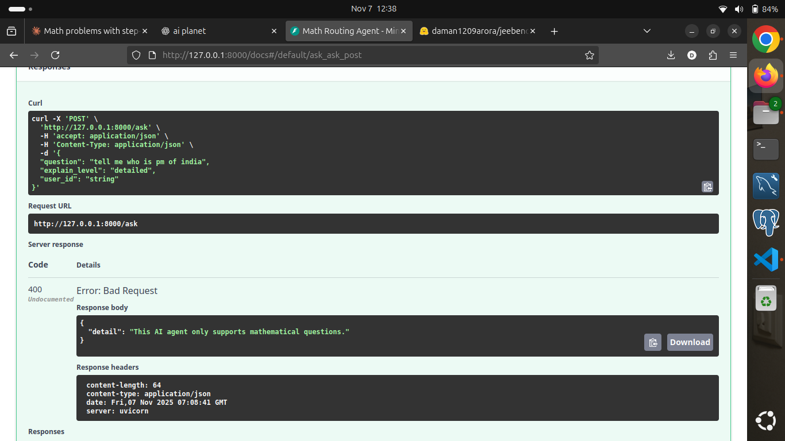
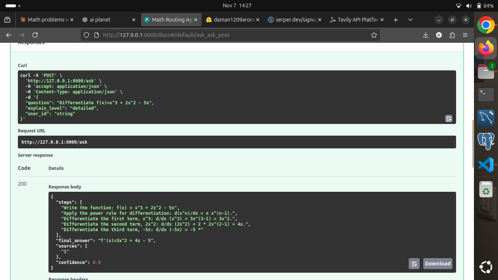
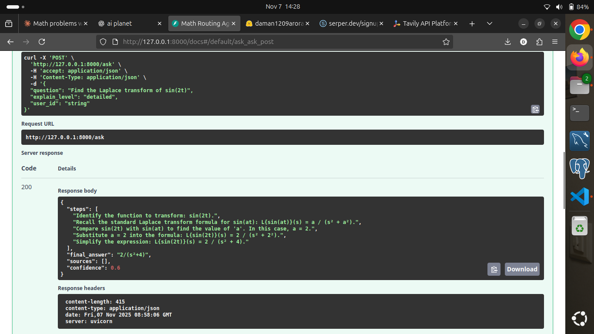

# 🧮 Math Agent

A full-stack **AI Math Assistant** that provides step-by-step solutions to math problems using advanced AI and vector search capabilities.

---

## 🌟 Overview

This application combines **Google Gemini API**, **Qdrant Vector Database**, **FastAPI**, and **React** to create an intelligent math tutoring system that:

- Retrieves relevant solutions from a knowledge base
- Generates step-by-step explanations
- Falls back to web search when needed
- Learns and improves from user feedback

---

## 🚀 Key Features

✅ Step-by-step solutions for calculus, algebra, geometry, and more  
✅ Vector-based retrieval using Qdrant  
✅ AI-powered reasoning via Google Gemini  
✅ Web search fallback using Serper API  
✅ User feedback loop with auto-retraining  
✅ React + Tailwind frontend  
✅ Math-only guardrails for input/output safety  

---

## 🏗️ Architecture

```
┌─────────────┐         ┌──────────────┐         ┌─────────────┐
│   React     │ ─HTTP─> │   FastAPI    │ ─────> │   Gemini    │
│  Frontend   │         │   Backend    │         │     API     │
└─────────────┘         └──────────────┘         └─────────────┘
                               │                          
                               │                          
                        ┌──────▼───────┐         
                        │    Qdrant    │         
                        │ Vector Store │         
                        └──────────────┘         
```

---

## 📁 Project Structure

```
math_agent/
├── backend/
│   ├── main.py                 # FastAPI entrypoint
│   ├── utils/                  # Helper modules
│   │   ├── core.py             # Gemini, Qdrant, embeddings
│   │   ├── guardrails.py       # Input/output filters
│   │   └── retraining.py       # Feedback-based retraining
│   ├── routes/                 # Modular API routes
│   │   ├── ask.py              # /ask endpoint
│   │   └── feedback.py         # /feedback endpoint
│   ├── models/                 # Pydantic schemas
│   │   ├── ask_model.py
│   │   └── feedback_model.py
│   ├── scripts/
│   │   ├── ingest_kb.py        # Ingest CSV into Qdrant
│   │   ├── retrain_kb.py       # Retrain from feedback
│   │   └── search_kb.py        # Test local search
│   ├── data/
│   │   └── math_kb.csv         # Knowledge base dataset
│   ├── requirements.txt
│   └── .env
│
├── frontend/
│   ├── src/
│   │   ├── App.jsx
│   │   ├── main.jsx
│   │   ├── api.js
│   │   ├── styles.css
│   │   └── components/
│   │       ├── AskForm.jsx
│   │       ├── AnswerCard.jsx
│   │       └── FeedbackForm.jsx
│   ├── package.json
│   ├── vite.config.js
│   ├── tailwind.config.js
│   └── postcss.config.js
│
└── README.md
```

---

## 🛠️ Installation & Setup

### Prerequisites

- **Python 3.10+**
- **Node.js 16+**
- **Docker** (for Qdrant)
- **Google API Key** ([Get one here](https://makersuite.google.com/app/apikey))

---

## 🔧 Backend Setup

### 1. Create Virtual Environment

```bash
cd backend
python3 -m venv myenv
source myenv/bin/activate   # On Windows: myenv\Scripts\activate
```

### 2. Install Dependencies

```bash
pip install -r requirements.txt
```

### 3. Create `.env`

```env
GOOGLE_API_KEY=your_google_api_key
QDRANT_URL=http://localhost:6333
COLLECTION_NAME=math_kb
GEMINI_EMBED_MODEL=embedding-001
GEMINI_GEN_MODEL=gemini-2.5-flash
KB_THRESHOLD=0.78
KB_TOPK=3
SERPER_API_KEY=your_serper_key  # optional
```

### 4. Start Qdrant

```bash
docker run -p 6333:6333 -v qdrant_storage:/qdrant/storage qdrant/qdrant
```

### 5. Ingest Knowledge Base

```bash
python3 scripts/ingest_kb.py
```

### 6. Start FastAPI Backend

```bash
uvicorn main:app --reload
```

**Access API docs →** [http://localhost:8000/docs](http://localhost:8000/docs)

---

## 💻 Frontend Setup

### 1. Install Dependencies

```bash
cd frontend
npm install
```

### 2. Configure Tailwind

**tailwind.config.js:**
```javascript
export default {
  content: ['./index.html', './src/**/*.{js,jsx}'],
  theme: { extend: {} },
  plugins: [],
}
```

### 3. Start Development Server

```bash
npm run dev
```

**Access app →** [http://localhost:5173](http://localhost:5173)

---

## 🎯 Usage

### Example API Request

**POST /ask**

```json
{
  "question": "Differentiate x^3 + 2x^2 - 5x",
  "explain_level": "detailed",
  "user_id": "student_001"
}
```

### Response

```json
{
  "steps": [
    "1. Write f(x) = x³ + 2x² - 5x",
    "2. Apply power rule: d(xⁿ)/dx = n·xⁿ⁻¹",
    "3. Derivative of x³ is 3x²",
    "4. Derivative of 2x² is 4x",
    "5. Derivative of -5x is -5",
    "6. Combine: f'(x) = 3x² + 4x - 5"
  ],
  "final_answer": "f'(x) = 3x² + 4x - 5",
  "confidence": 0.95
}
```

---

## 📸 Screenshots

### 1. Home Page


### 2. Ask Question Interface


### 3. Step-by-Step Solution


### 4. Feedback Form


### 5. API Documentation


### 6. Knowledge Base Visualization


---

## 🔄 Feedback & Retraining

User feedback is stored in `data/feedback_log.csv`.

To retrain:

```bash
python3 scripts/retrain_kb.py
```

This:
- Reads high-rated feedback (rating ≥ 4)
- Embeds it
- Adds it back into Qdrant

---

## 🚀 Quick Start After Reboot

```bash
# Start Qdrant
docker run -p 6333:6333 -v qdrant_storage:/qdrant/storage qdrant/qdrant

# Start backend
cd backend
source myenv/bin/activate
uvicorn main:app --reload

# Start frontend
cd frontend
npm run dev
```

---

## 📊 Knowledge Base Format

`math_kb.csv` example:

```csv
id,question,final_answer,steps,tags
1,"Differentiate f(x)=x^3","f'(x)=3x^2","1. Apply power rule...","calculus,derivative"
```

---

## 🔒 Environment Variables

| Variable | Description | Default |
|----------|-------------|---------|
| `GOOGLE_API_KEY` | Gemini API key | — |
| `QDRANT_URL` | Qdrant endpoint | `http://localhost:6333` |
| `COLLECTION_NAME` | Vector DB name | `math_kb` |
| `GEMINI_EMBED_MODEL` | Embedding model | `embedding-001` |
| `GEMINI_GEN_MODEL` | Generation model | `gemini-2.5-flash` |
| `KB_THRESHOLD` | Similarity cutoff | `0.78` |
| `KB_TOPK` | Top results | `3` |
| `SERPER_API_KEY` | (optional) web search | — |

---

## 🛡️ Safety & Guardrails

### Input Guardrails
- Allows only math questions
- Blocks irrelevant or unsafe content

### Output Guardrails
- Filters out non-math or unsafe answers
- Keeps clean step-by-step output

---

## 🧰 Troubleshooting

### Port in Use

```bash
lsof -ti:8000 | xargs kill -9
lsof -ti:5173 | xargs kill -9
```

### Missing Dependencies

```bash
pip install -r requirements.txt
npm install
```

### Qdrant Connection

```bash
docker ps | grep qdrant
docker restart <container_id>
```

---

## 📚 Tech Stack

| Layer | Technology |
|-------|-----------|
| **Backend** | FastAPI, Pydantic, Requests |
| **AI** | Google Gemini API |
| **Vector DB** | Qdrant |
| **Frontend** | React 18, Vite, Tailwind CSS |
| **Infra** | Docker, Uvicorn |

---

## 🤝 Contributing

Contributions are welcome! Please:

1. Fork the repository
2. Create a feature branch (`git checkout -b feature/AmazingFeature`)
3. Commit changes (`git commit -m 'Add AmazingFeature'`)
4. Push to branch (`git push origin feature/AmazingFeature`)
5. Open a Pull Request

---

## 📝 License

This project is licensed under the **MIT License**.

---

## 👨‍💻 Author

**Ashutosh Jarag**  
🎓 B.Tech in Computer Science – Shivaji University, Kolhapur  
💡 Data Science & AI Enthusiast | Python | FastAPI | React | Power BI  
📧 jaragashutosh11@gmail.com  

---

## 🙏 Acknowledgments

- Google Gemini API for AI capabilities
- Qdrant for vector search infrastructure
- FastAPI community for excellent documentation
- React and Tailwind CSS teams for frontend tools

---

**⭐ Star this repository if you find it helpful!**
